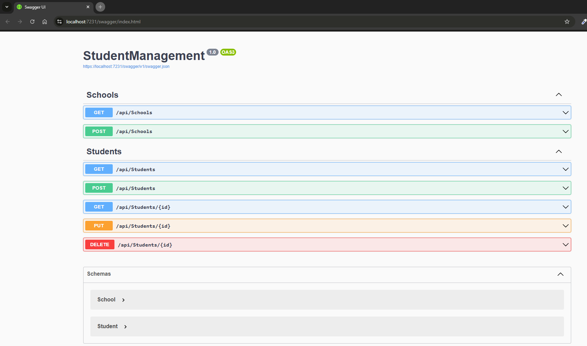
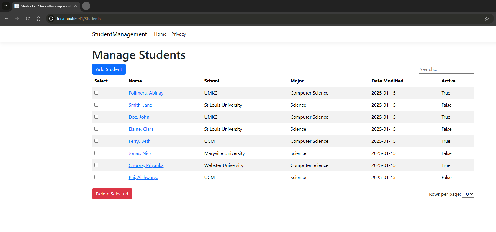
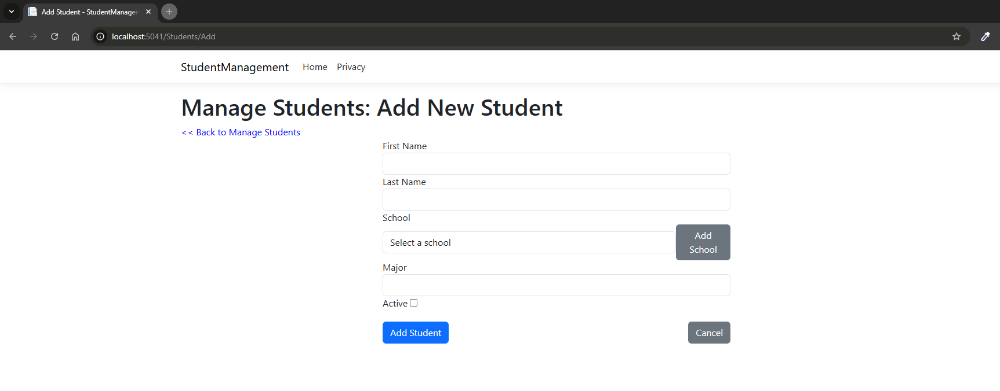
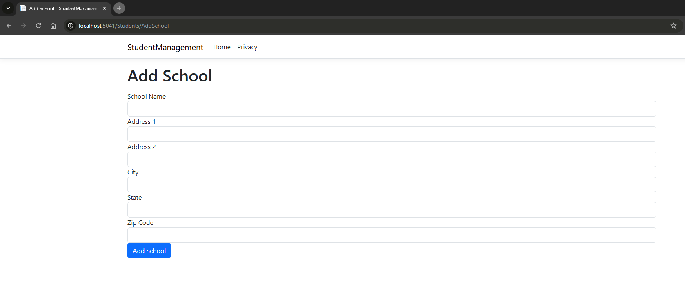
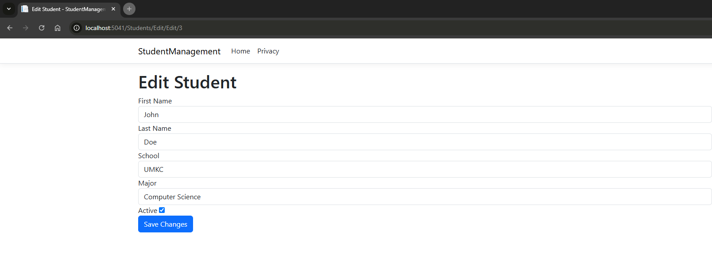
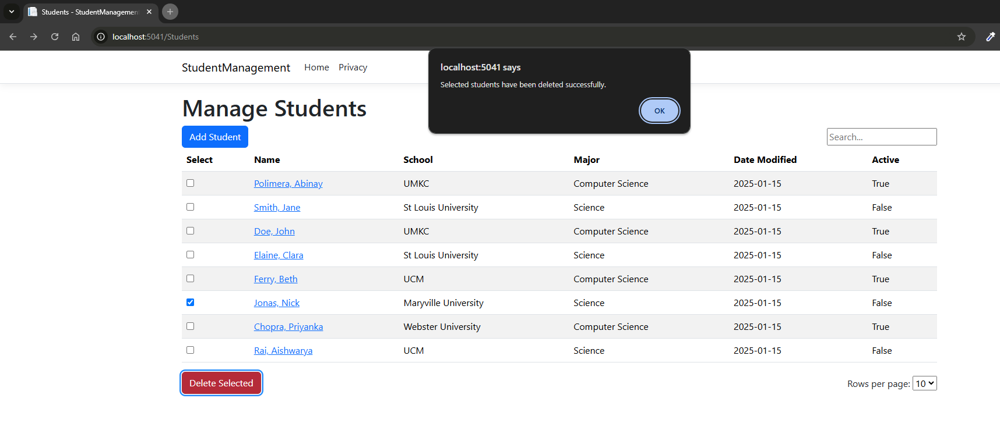

# Student Management Application

## Summary

* Basic CRUD operations application for student management.

### Setup
* The source code repository has student-management-be for backend services integrated with swagger.
* APIs are available at https://localhost:7231/api

* Swagger UI is available on application startup.

* student-management-frontend is the frontend application built with Razor pages.

* Run the ```dotnet run``` to start the application and access the UI at https://localhost:5041/Students

## Application Screenshots
* Swagger UI



* Student Management UI



* Add Student



* Add School



* Edit Student



* Delete Student


